# Gravity Sling Optimal Solutions

Generated from `gravity_sling.html` at `2026-06-17T08:59:58.622Z`.

The solver ranks winning shots by the same score formula as the game, so lower launch speed wins when a route still reaches the target. Screenshots show the aiming state for the logged drag point.

Screenshot prediction ratio: `1` (source game ratio: `0.2`).

## Mission 1: Direkter Flug

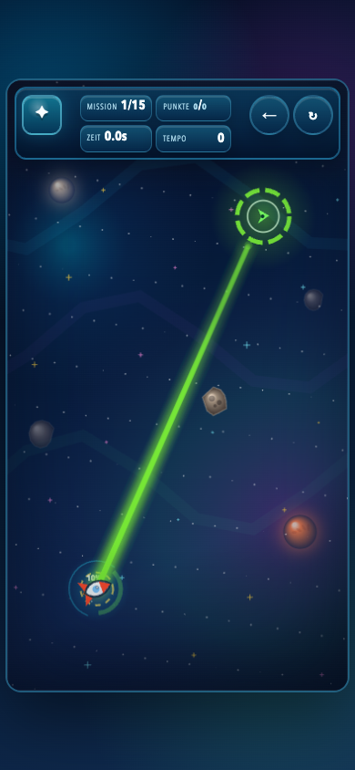

- Score: `1138`
- Drag handle: `x 137.1, y 811.0`
- From launch: 4.9 px left, 11.0 px down (10% power)
- Launch point: `x 142.0, y 800.0`
- Pull vector: `x 4.9, y -11.0`
- Launch speed: `20.1`
- Arrival: `target_reached` at `29.48s`, speed `20.1`
- Atmosphere time: `0.00s`; max strength `0.000`
- Browser replay: `target_reached`, score `1138`, speed `20.1`

## Mission 2: Erste Ablenkung

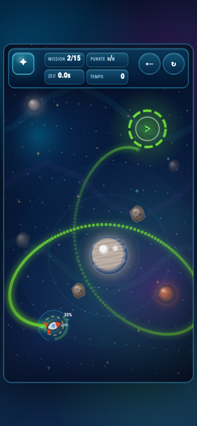

- Score: `877`
- Drag handle: `x 182.7, y 796.8`
- From launch: 40.7 px right, 3.2 px up (35% power)
- Launch point: `x 142.0, y 800.0`
- Pull vector: `x -40.7, y 3.2`
- Launch speed: `68.3`
- Arrival: `target_reached` at `24.52s`, speed `41.1`
- Atmosphere time: `0.00s`; max strength `0.000`
- Browser replay: `target_reached`, score `877`, speed `41.1`

## Mission 3: Atmosphären-Fenster

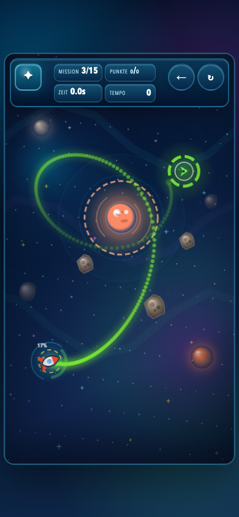

- Score: `1234`
- Drag handle: `x 87.8, y 711.8`
- From launch: 18.2 px left, 8.2 px up (17% power)
- Launch point: `x 106.0, y 720.0`
- Pull vector: `x 18.2, y 8.2`
- Launch speed: `33.5`
- Arrival: `target_reached` at `15.53s`, speed `73.2`
- Atmosphere time: `1.70s`; max strength `0.327`
- Browser replay: `target_reached`, score `1234`, speed `73.2`

## Mission 4: Sonnen-Schwung

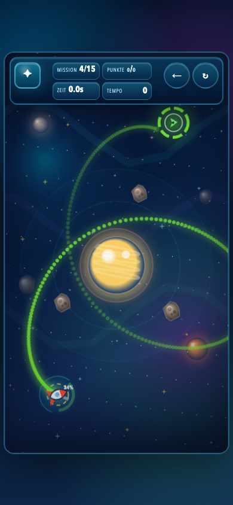

- Score: `1226`
- Drag handle: `x 153.9, y 832.0`
- From launch: 25.9 px right, 12.0 px down (24% power)
- Launch point: `x 128.0, y 820.0`
- Pull vector: `x -25.9, y -12.0`
- Launch speed: `47.7`
- Arrival: `target_reached` at `22.75s`, speed `47.8`
- Atmosphere time: `0.00s`; max strength `0.000`
- Browser replay: `target_reached`, score `1226`, speed `47.8`

## Mission 5: Doppelpass

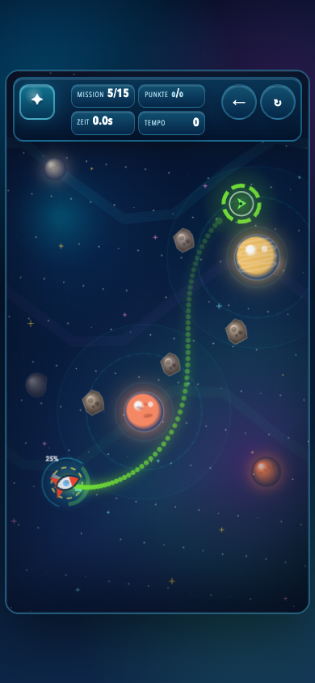

- Score: `1309`
- Drag handle: `x 81.5, y 716.1`
- From launch: 26.5 px left, 13.9 px up (25% power)
- Launch point: `x 108.0, y 730.0`
- Pull vector: `x 26.5, y 13.9`
- Launch speed: `50.1`
- Arrival: `target_reached` at `5.38s`, speed `130.3`
- Atmosphere time: `0.00s`; max strength `0.000`
- Browser replay: `target_reached`, score `1309`, speed `130.3`

## Mission 6: Saturn-Lücke

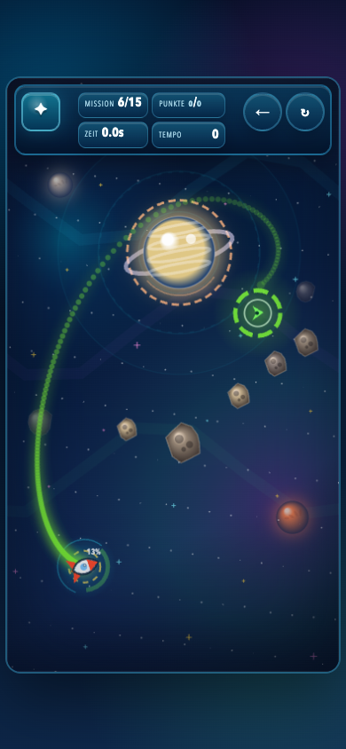

- Score: `1588`
- Drag handle: `x 141.0, y 795.0`
- From launch: 15.0 px right, 5.0 px down (13% power)
- Launch point: `x 126.0, y 790.0`
- Pull vector: `x -15.0, y -5.0`
- Launch speed: `26.5`
- Arrival: `target_reached` at `12.68s`, speed `84.4`
- Atmosphere time: `0.70s`; max strength `0.729`
- Browser replay: `target_reached`, score `1588`, speed `84.4`

## Mission 7: Äußere Bahn

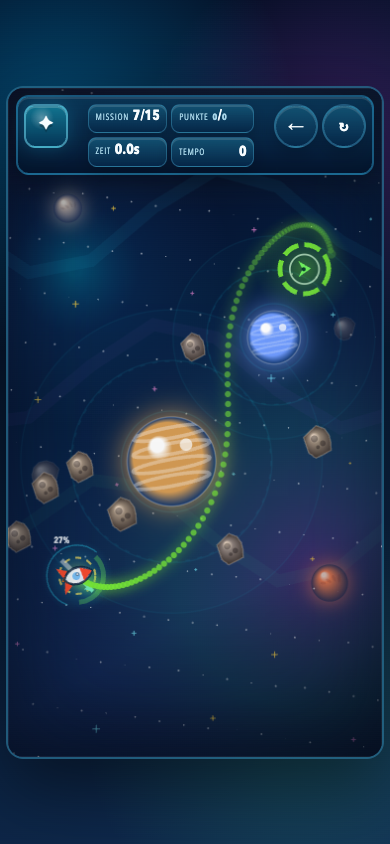

- Score: `1485`
- Drag handle: `x 77.3, y 677.8`
- From launch: 22.7 px left, 22.2 px up (27% power)
- Launch point: `x 100.0, y 700.0`
- Pull vector: `x 22.7, y 22.2`
- Launch speed: `53.3`
- Arrival: `target_reached` at `7.70s`, speed `66.5`
- Atmosphere time: `0.00s`; max strength `0.000`
- Browser replay: `target_reached`, score `1485`, speed `66.5`

## Mission 8: Einfangen bei Pluto

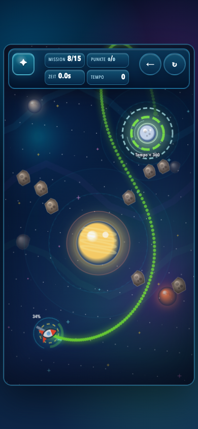

- Score: `1480`
- Drag handle: `x 92.2, y 796.0`
- From launch: 35.8 px left, 19.0 px up (34% power)
- Launch point: `x 128.0, y 815.0`
- Pull vector: `x 35.8, y 19.0`
- Launch speed: `67.8`
- Arrival: `target_reached` at `16.30s`, speed `141.6`
- Atmosphere time: `0.13s`; max strength `0.288`
- Browser replay: `target_reached`, score `1480`, speed `141.6`

## Mission 9: Drei-Körper-Kanal

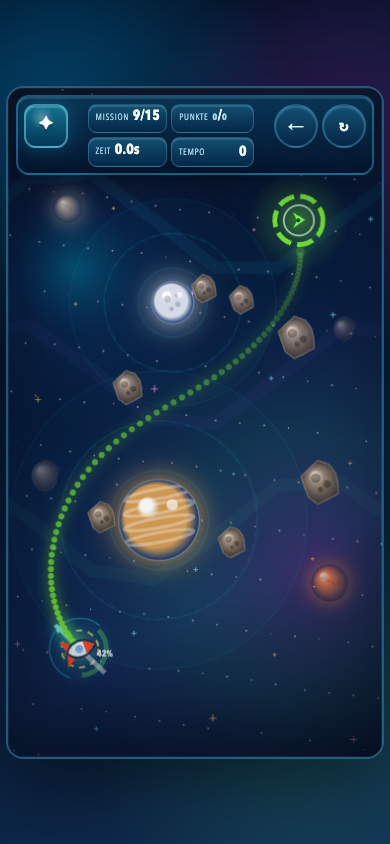

- Score: `1472`
- Drag handle: `x 139.9, y 839.5`
- From launch: 35.9 px right, 34.5 px down (42% power)
- Launch point: `x 104.0, y 805.0`
- Pull vector: `x -35.9, y -34.5`
- Launch speed: `83.4`
- Arrival: `target_reached` at `5.83s`, speed `60.2`
- Atmosphere time: `0.00s`; max strength `0.000`
- Browser replay: `target_reached`, score `1472`, speed `60.2`

## Mission 10: Finaler Sonnenbogen

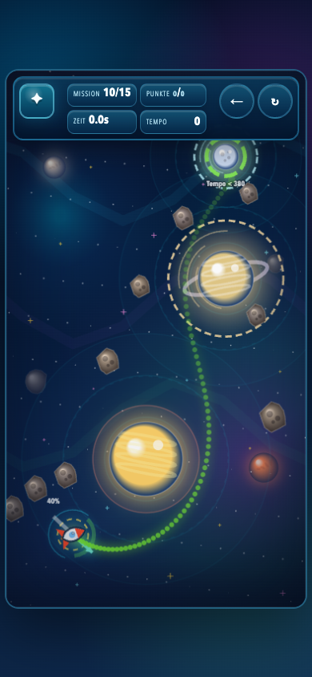

- Score: `1598`
- Drag handle: `x 84.8, y 797.9`
- From launch: 35.2 px left, 32.1 px up (40% power)
- Launch point: `x 120.0, y 830.0`
- Pull vector: `x 35.2, y 32.1`
- Launch speed: `79.7`
- Arrival: `target_reached` at `6.58s`, speed `125.8`
- Atmosphere time: `1.38s`; max strength `0.630`
- Browser replay: `target_reached`, score `1598`, speed `125.8`

## Mission 11: Orbit-Schleuse

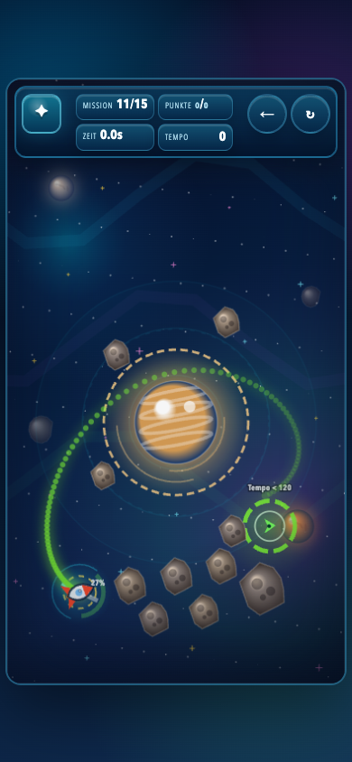

- Score: `1885`
- Drag handle: `x 144.7, y 828.6`
- From launch: 28.7 px right, 13.6 px down (27% power)
- Launch point: `x 116.0, y 815.0`
- Pull vector: `x -28.7, y -13.6`
- Launch speed: `53.3`
- Arrival: `target_reached` at `7.90s`, speed `92.5`
- Atmosphere time: `1.23s`; max strength `0.925`
- Browser replay: `target_reached`, score `1885`, speed `92.5`

## Mission 12: Kometenschweif

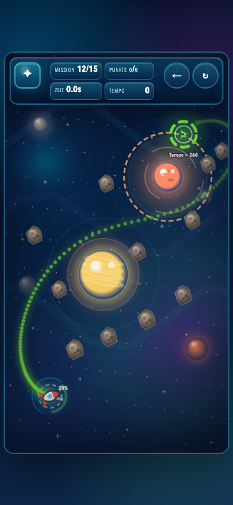

- Score: `1976`
- Drag handle: `x 141.4, y 832.8`
- From launch: 31.4 px right, 8.8 px down (28% power)
- Launch point: `x 110.0, y 824.0`
- Pull vector: `x -31.4, y -8.8`
- Launch speed: `54.6`
- Arrival: `target_reached` at `9.92s`, speed `89.4`
- Atmosphere time: `0.87s`; max strength `0.269`
- Browser replay: `target_reached`, score `1976`, speed `89.4`

## Mission 13: Bremskorridor

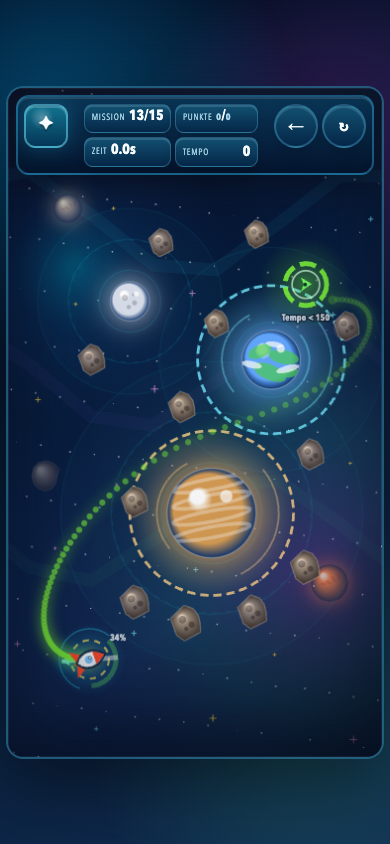

- Score: `1978`
- Drag handle: `x 158.6, y 817.1`
- From launch: 40.6 px right, 2.9 px up (34% power)
- Launch point: `x 118.0, y 820.0`
- Pull vector: `x -40.6, y 2.9`
- Launch speed: `68.2`
- Arrival: `target_reached` at `7.70s`, speed `95.4`
- Atmosphere time: `1.50s`; max strength `0.617`
- Browser replay: `target_reached`, score `1978`, speed `95.4`

## Mission 14: Mondstaffel

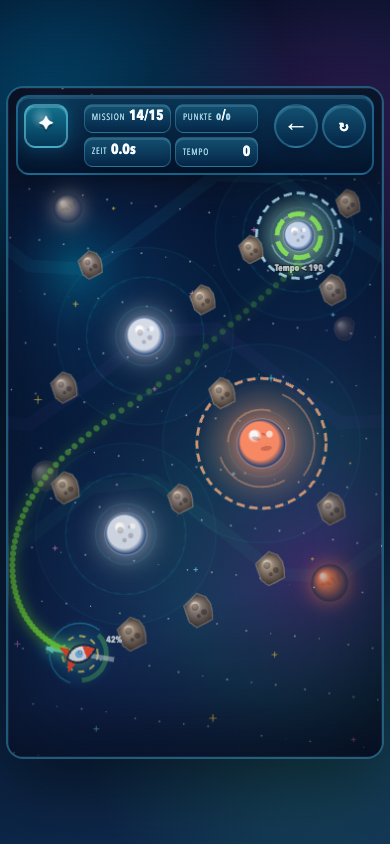

- Score: `1972`
- Drag handle: `x 153.1, y 820.3`
- From launch: 49.1 px right, 8.3 px down (42% power)
- Launch point: `x 104.0, y 812.0`
- Pull vector: `x -49.1, y -8.3`
- Launch speed: `83.4`
- Arrival: `target_reached` at `5.95s`, speed `173.4`
- Atmosphere time: `0.17s`; max strength `0.645`
- Browser replay: `target_reached`, score `1972`, speed `173.4`

## Mission 15: Resonanz-Finale

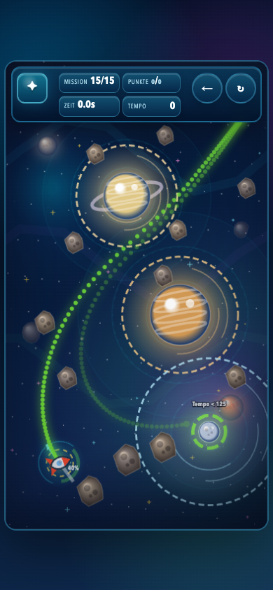

- Score: `2101`
- Drag handle: `x 139.6, y 862.4`
- From launch: 27.6 px right, 38.4 px down (40% power)
- Launch point: `x 112.0, y 824.0`
- Pull vector: `x -27.6, y -38.4`
- Launch speed: `79.2`
- Arrival: `target_reached` at `15.23s`, speed `115.1`
- Atmosphere time: `2.15s`; max strength `0.851`
- Browser replay: `target_reached`, score `2101`, speed `115.1`

