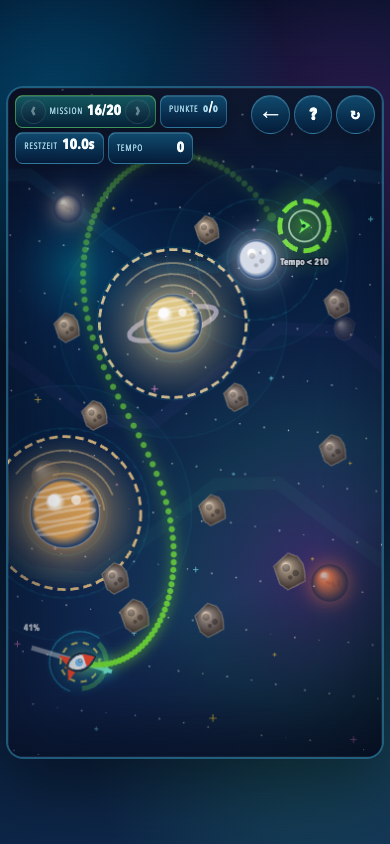
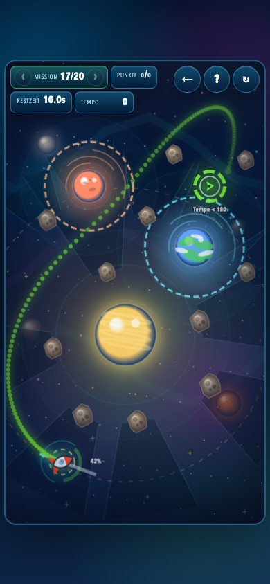
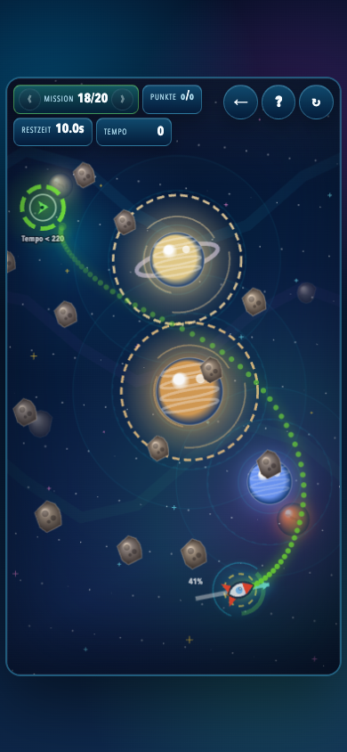
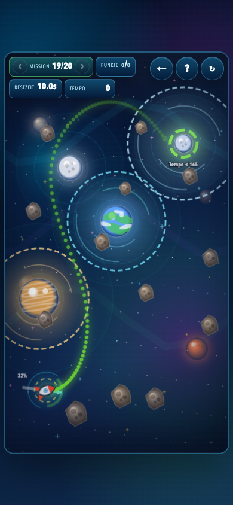
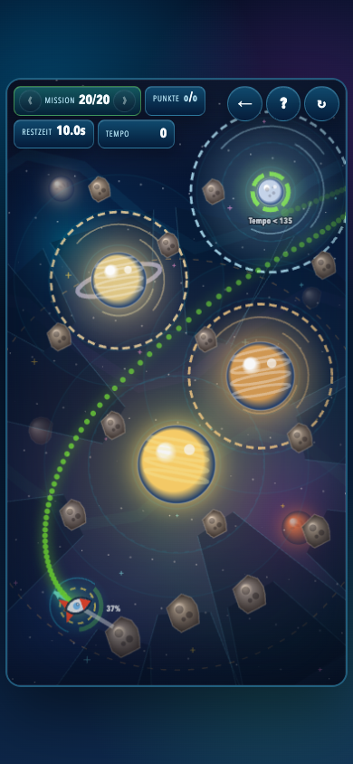

# Gravitas Optimal Solutions

Generated from `gravity_sling.html` at `2026-06-27T11:09:42.143Z`.

The solver ranks winning shots by the same score formula as the game: the logged best launch speed for each mission is worth 100 points, a 100% launch is worth 10 points, and intermediate launch speeds are linearly scaled between those anchors.

Screenshot prediction ratio: `1` (source game ratio: `0.1`).

## Mission 1: Direkter Flug

- Score: `100`
- Drag handle: `x 134.6, y 816.4`
- From launch: 7.4 px left, 16.4 px down (10% power)
- Launch point: `x 142.0, y 800.0`
- Pull vector: `x 7.4, y -16.4`
- Launch speed: `19.8`
- Arrival: `target_reached` at `29.98s`, speed `19.8`
- Atmosphere time: `0.00s`; max strength `0.000`
- Heat: peak `0%`; exposed `0.00s`; shadow `0.00s`
- Browser replay: `target_reached`, score `100`, speed `19.8`

## Mission 2: Erste Ablenkung

- Score: `100`
- Drag handle: `x 203.0, y 797.4`
- From launch: 61.0 px right, 2.6 px up (34% power)
- Launch point: `x 142.0, y 800.0`
- Pull vector: `x -61.0, y 2.6`
- Launch speed: `67.1`
- Arrival: `target_reached` at `23.88s`, speed `42.3`
- Atmosphere time: `0.00s`; max strength `0.000`
- Heat: peak `0%`; exposed `0.00s`; shadow `0.00s`
- Browser replay: `target_reached`, score `100`, speed `42.3`

## Mission 3: Atmosphären-Fenster

- Score: `100`
- Drag handle: `x 78.4, y 706.9`
- From launch: 27.6 px left, 13.1 px up (17% power)
- Launch point: `x 106.0, y 720.0`
- Pull vector: `x 27.6, y 13.1`
- Launch speed: `33.5`
- Arrival: `target_reached` at `15.58s`, speed `73.4`
- Atmosphere time: `1.70s`; max strength `0.326`
- Heat: peak `0%`; exposed `0.00s`; shadow `0.00s`
- Browser replay: `target_reached`, score `100`, speed `73.4`

## Mission 4: Sonnen-Schwung

- Score: `100`
- Drag handle: `x 167.0, y 833.4`
- From launch: 39.0 px right, 13.4 px down (23% power)
- Launch point: `x 128.0, y 820.0`
- Pull vector: `x -39.0, y -13.4`
- Launch speed: `45.3`
- Arrival: `target_reached` at `23.52s`, speed `50.0`
- Atmosphere time: `0.00s`; max strength `0.000`
- Heat: peak `75%`; exposed `6.78s`; shadow `0.00s`
- Browser replay: `target_reached`, score `100`, speed `50.0`

## Mission 5: Doppelpass

- Score: `100`
- Drag handle: `x 67.9, y 708.2`
- From launch: 40.1 px left, 21.8 px up (25% power)
- Launch point: `x 108.0, y 730.0`
- Pull vector: `x 40.1, y 21.8`
- Launch speed: `50.1`
- Arrival: `target_reached` at `5.42s`, speed `129.5`
- Atmosphere time: `0.00s`; max strength `0.000`
- Heat: peak `0%`; exposed `0.00s`; shadow `0.00s`
- Browser replay: `target_reached`, score `100`, speed `129.5`

## Mission 6: Saturn-Lücke

- Score: `100`
- Drag handle: `x 149.2, y 796.2`
- From launch: 23.2 px right, 6.2 px down (13% power)
- Launch point: `x 126.0, y 790.0`
- Pull vector: `x -23.2, y -6.2`
- Launch speed: `26.4`
- Arrival: `target_reached` at `12.77s`, speed `87.2`
- Atmosphere time: `0.72s`; max strength `0.760`
- Heat: peak `0%`; exposed `0.00s`; shadow `0.00s`
- Browser replay: `target_reached`, score `100`, speed `87.2`

## Mission 7: Äußere Bahn

- Score: `100`
- Drag handle: `x 63.4, y 668.2`
- From launch: 36.6 px left, 31.8 px up (27% power)
- Launch point: `x 100.0, y 700.0`
- Pull vector: `x 36.6, y 31.8`
- Launch speed: `53.3`
- Arrival: `target_reached` at `7.73s`, speed `71.1`
- Atmosphere time: `0.00s`; max strength `0.000`
- Heat: peak `0%`; exposed `0.00s`; shadow `0.00s`
- Browser replay: `target_reached`, score `100`, speed `71.1`

## Mission 8: Einfangen bei Pluto

- Score: `100`
- Drag handle: `x 93.7, y 799.0`
- From launch: 34.3 px left, 16.0 px up (21% power)
- Launch point: `x 128.0, y 815.0`
- Pull vector: `x 34.3, y 16.0`
- Launch speed: `41.5`
- Arrival: `target_reached` at `12.72s`, speed `131.4`
- Atmosphere time: `0.13s`; max strength `0.265`
- Heat: peak `71%`; exposed `3.37s`; shadow `0.00s`
- Browser replay: `target_reached`, score `100`, speed `131.4`

## Mission 9: Drei-Körper-Kanal

- Score: `100`
- Drag handle: `x 161.1, y 854.8`
- From launch: 57.1 px right, 49.8 px down (42% power)
- Launch point: `x 104.0, y 805.0`
- Pull vector: `x -57.1, y -49.8`
- Launch speed: `83.2`
- Arrival: `target_reached` at `5.93s`, speed `59.1`
- Atmosphere time: `0.00s`; max strength `0.000`
- Heat: peak `0%`; exposed `0.00s`; shadow `0.00s`
- Browser replay: `target_reached`, score `100`, speed `59.1`

## Mission 10: Finaler Sonnenbogen

- Score: `100`
- Drag handle: `x 89.7, y 777.7`
- From launch: 30.3 px left, 52.3 px up (34% power)
- Launch point: `x 120.0, y 830.0`
- Pull vector: `x 30.3, y 52.3`
- Launch speed: `66.3`
- Arrival: `target_reached` at `6.77s`, speed `147.7`
- Atmosphere time: `0.35s`; max strength `0.484`
- Heat: peak `94%`; exposed `5.75s`; shadow `0.00s`
- Browser replay: `target_reached`, score `100`, speed `147.7`

## Mission 11: Orbit-Schleuse

- Score: `100`
- Drag handle: `x 159.6, y 836.3`
- From launch: 43.6 px right, 21.3 px down (27% power)
- Launch point: `x 116.0, y 815.0`
- Pull vector: `x -43.6, y -21.3`
- Launch speed: `53.3`
- Arrival: `target_reached` at `7.90s`, speed `93.3`
- Atmosphere time: `1.22s`; max strength `0.922`
- Heat: peak `0%`; exposed `0.00s`; shadow `0.00s`
- Browser replay: `target_reached`, score `100`, speed `93.3`

## Mission 12: Kometenschweif

- Score: `100`
- Drag handle: `x 151.2, y 842.3`
- From launch: 41.2 px right, 18.3 px down (25% power)
- Launch point: `x 110.0, y 824.0`
- Pull vector: `x -41.2, y -18.3`
- Launch speed: `49.5`
- Arrival: `target_reached` at `8.95s`, speed `80.6`
- Atmosphere time: `0.92s`; max strength `0.296`
- Heat: peak `53%`; exposed `1.48s`; shadow `1.13s`
- Browser replay: `target_reached`, score `100`, speed `80.6`

## Mission 13: Bremskorridor

- Score: `100`
- Drag handle: `x 149.6, y 842.9`
- From launch: 31.6 px right, 22.9 px down (22% power)
- Launch point: `x 118.0, y 820.0`
- Pull vector: `x -31.6, y -22.9`
- Launch speed: `42.8`
- Arrival: `target_reached` at `6.25s`, speed `107.1`
- Atmosphere time: `1.62s`; max strength `0.997`
- Heat: peak `0%`; exposed `0.00s`; shadow `0.00s`
- Browser replay: `target_reached`, score `100`, speed `107.1`

## Mission 14: Mondstaffel

- Score: `100`
- Drag handle: `x 179.1, y 823.1`
- From launch: 75.1 px right, 11.1 px down (42% power)
- Launch point: `x 104.0, y 812.0`
- Pull vector: `x -75.1, y -11.1`
- Launch speed: `83.3`
- Arrival: `target_reached` at `6.03s`, speed `171.3`
- Atmosphere time: `0.18s`; max strength `0.597`
- Heat: peak `0%`; exposed `0.00s`; shadow `0.00s`
- Browser replay: `target_reached`, score `100`, speed `171.3`

## Mission 15: Resonanz-Finale

- Score: `100`
- Drag handle: `x 168.2, y 859.4`
- From launch: 56.2 px right, 35.4 px down (37% power)
- Launch point: `x 112.0, y 824.0`
- Pull vector: `x -56.2, y -35.4`
- Launch speed: `72.9`
- Arrival: `target_reached` at `15.32s`, speed `99.8`
- Atmosphere time: `1.85s`; max strength `0.843`
- Heat: peak `0%`; exposed `0.00s`; shadow `0.00s`
- Browser replay: `target_reached`, score `100`, speed `99.8`

## Mission 16: Jupiter-Saturn-Weiche

- Score: `100`
- Drag handle: `x 34.0, y 803.3`
- From launch: 70.0 px left, 20.7 px up (41% power)
- Launch point: `x 104.0, y 824.0`
- Pull vector: `x 70.0, y 20.7`
- Launch speed: `80.2`
- Arrival: `target_reached` at `8.87s`, speed `171.7`
- Atmosphere time: `0.00s`; max strength `0.000`
- Heat: peak `0%`; exposed `0.00s`; shadow `0.00s`
- Browser replay: `target_reached`, score `100`, speed `171.7`

## Mission 17: Schattennadel

- Score: `100`
- Drag handle: `x 188.6, y 858.2`
- From launch: 70.6 px right, 26.2 px down (42% power)
- Launch point: `x 118.0, y 832.0`
- Pull vector: `x -70.6, y -26.2`
- Launch speed: `82.7`
- Arrival: `target_reached` at `10.65s`, speed `119.7`
- Atmosphere time: `0.67s`; max strength `0.506`
- Heat: peak `17%`; exposed `3.37s`; shadow `2.08s`
- Browser replay: `target_reached`, score `100`, speed `119.7`

## Mission 18: Kreiselstaffel

- Score: `100`
- Drag handle: `x 305.9, y 837.9`
- From launch: 72.1 px left, 13.9 px down (41% power)
- Launch point: `x 378.0, y 824.0`
- Pull vector: `x 72.1, y -13.9`
- Launch speed: `80.6`
- Arrival: `target_reached` at `5.70s`, speed `34.5`
- Atmosphere time: `1.22s`; max strength `0.530`
- Heat: peak `0%`; exposed `0.00s`; shadow `0.00s`
- Browser replay: `target_reached`, score `100`, speed `34.5`

## Mission 19: Atmosphären-Slalom

- Score: `100`
- Drag handle: `x 42.5, y 802.4`
- From launch: 57.5 px left, 7.6 px up (32% power)
- Launch point: `x 100.0, y 810.0`
- Pull vector: `x 57.5, y 7.6`
- Launch speed: `63.7`
- Arrival: `target_reached` at `7.45s`, speed `118.6`
- Atmosphere time: `1.55s`; max strength `0.838`
- Heat: peak `0%`; exposed `0.00s`; shadow `0.00s`
- Browser replay: `target_reached`, score `100`, speed `118.6`

## Mission 20: Dreifach-Finale

- Score: `100`
- Drag handle: `x 169.1, y 867.6`
- From launch: 57.1 px right, 33.6 px down (37% power)
- Launch point: `x 112.0, y 834.0`
- Pull vector: `x -57.1, y -33.6`
- Launch speed: `72.8`
- Arrival: `target_reached` at `8.85s`, speed `127.8`
- Atmosphere time: `2.20s`; max strength `0.879`
- Heat: peak `13%`; exposed `2.67s`; shadow `1.73s`
- Browser replay: `target_reached`, score `100`, speed `127.8`
