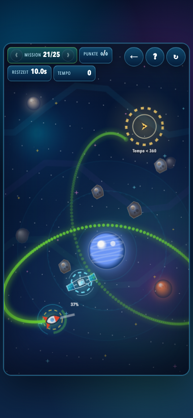
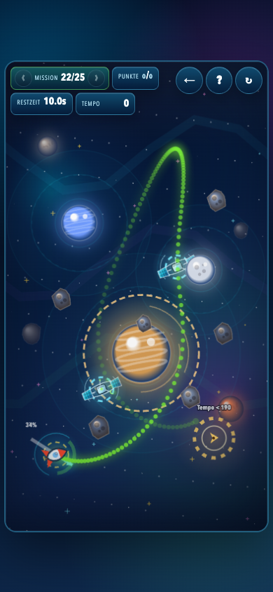
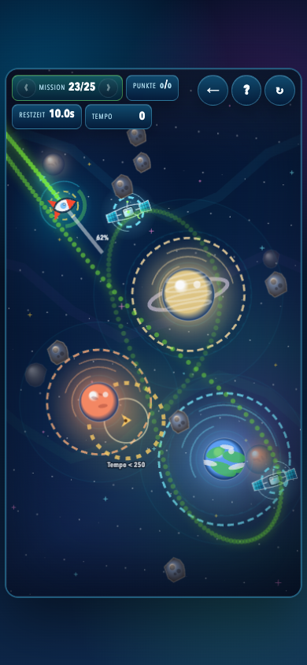
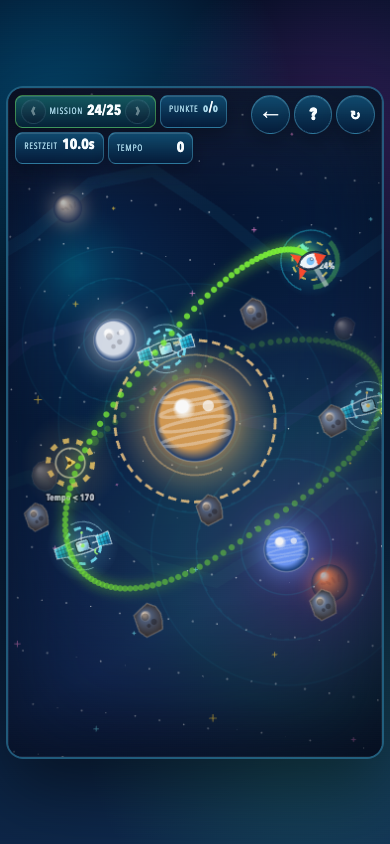
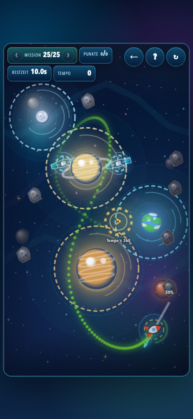

# Gravitas Optimal Solutions

Generated from `gravity_sling.html` at `2026-07-08T09:46:32.703Z`.

The solver ranks winning shots by the same score formula as the game: the logged best launch speed for each mission is worth 100 points, a 100% launch is worth 10 points, and intermediate launch speeds are linearly scaled between those anchors.

Screenshot prediction ratio: `1` (source game ratio: `0.1`).

## Mission 1: Direkter Flug

- Score: `99`
- Drag handle: `x 135.4, y 817.8`
- From launch: 6.6 px left, 17.8 px down (11% power)
- Launch point: `x 142.0, y 800.0`
- Pull vector: `x 6.6, y -17.8`
- Launch speed: `20.9`
- Arrival: `target_reached` at `29.72s`, speed `20.9`
- Atmosphere time: `0.00s`; max strength `0.000`
- Heat: peak `0%`; exposed `0.00s`; shadow `0.00s`
- Browser replay: `target_reached`, score `99`, speed `20.9`

## Mission 2: Erste Ablenkung

- Score: `97`
- Drag handle: `x 205.6, y 785.3`
- From launch: 63.6 px right, 14.7 px up (36% power)
- Launch point: `x 142.0, y 800.0`
- Pull vector: `x -63.6, y 14.7`
- Launch speed: `71.7`
- Arrival: `target_reached` at `27.02s`, speed `40.5`
- Atmosphere time: `0.00s`; max strength `0.000`
- Heat: peak `0%`; exposed `0.00s`; shadow `0.00s`
- Browser replay: `target_reached`, score `97`, speed `40.5`

## Mission 3: Atmosphären-Fenster

- Score: `97`
- Drag handle: `x 135.4, y 739.9`
- From launch: 29.4 px right, 19.9 px down (20% power)
- Launch point: `x 106.0, y 720.0`
- Pull vector: `x -29.4, y -19.9`
- Launch speed: `39.0`
- Arrival: `target_reached` at `7.60s`, speed `130.1`
- Atmosphere time: `0.10s`; max strength `0.001`
- Heat: peak `0%`; exposed `0.00s`; shadow `0.00s`
- Browser replay: `target_reached`, score `97`, speed `130.1`

## Mission 4: Sonnen-Schwung

- Score: `99`
- Drag handle: `x 170.9, y 817.7`
- From launch: 42.9 px right, 2.3 px up (24% power)
- Launch point: `x 128.0, y 820.0`
- Pull vector: `x -42.9, y 2.3`
- Launch speed: `47.2`
- Arrival: `target_reached` at `25.38s`, speed `49.9`
- Atmosphere time: `0.00s`; max strength `0.000`
- Heat: peak `78%`; exposed `6.53s`; shadow `0.00s`
- Browser replay: `target_reached`, score `99`, speed `49.9`

## Mission 5: Doppelpass

- Score: `98`
- Drag handle: `x 66.6, y 704.9`
- From launch: 41.4 px left, 25.1 px up (27% power)
- Launch point: `x 108.0, y 730.0`
- Pull vector: `x 41.4, y 25.1`
- Launch speed: `53.1`
- Arrival: `target_reached` at `5.52s`, speed `128.4`
- Atmosphere time: `0.00s`; max strength `0.000`
- Heat: peak `0%`; exposed `0.00s`; shadow `0.00s`
- Browser replay: `target_reached`, score `98`, speed `128.4`

## Mission 6: Saturn-Lücke

- Score: `100`
- Drag handle: `x 147.5, y 801.5`
- From launch: 21.5 px right, 11.5 px down (14% power)
- Launch point: `x 126.0, y 790.0`
- Pull vector: `x -21.5, y -11.5`
- Launch speed: `26.8`
- Arrival: `target_reached` at `12.15s`, speed `95.1`
- Atmosphere time: `0.73s`; max strength `0.777`
- Heat: peak `0%`; exposed `0.00s`; shadow `0.00s`
- Browser replay: `target_reached`, score `100`, speed `95.1`

## Mission 7: Äußere Bahn

- Score: `99`
- Drag handle: `x 71.1, y 659.7`
- From launch: 28.9 px left, 40.3 px up (28% power)
- Launch point: `x 100.0, y 700.0`
- Pull vector: `x 28.9, y 40.3`
- Launch speed: `54.5`
- Arrival: `target_reached` at `7.83s`, speed `62.0`
- Atmosphere time: `0.00s`; max strength `0.000`
- Heat: peak `0%`; exposed `0.00s`; shadow `0.00s`
- Browser replay: `target_reached`, score `99`, speed `62.0`

## Mission 8: Einfangen bei Pluto

- Score: `100`
- Drag handle: `x 98.7, y 790.4`
- From launch: 29.3 px left, 24.6 px up (21% power)
- Launch point: `x 128.0, y 815.0`
- Pull vector: `x 29.3, y 24.6`
- Launch speed: `41.9`
- Arrival: `target_reached` at `13.55s`, speed `134.5`
- Atmosphere time: `0.12s`; max strength `0.275`
- Heat: peak `70%`; exposed `3.35s`; shadow `0.00s`
- Browser replay: `target_reached`, score `100`, speed `134.5`

## Mission 9: Drei-Körper-Kanal

- Score: `96`
- Drag handle: `x 144.0, y 874.3`
- From launch: 40.0 px right, 69.3 px down (44% power)
- Launch point: `x 104.0, y 805.0`
- Pull vector: `x -40.0, y -69.3`
- Launch speed: `87.8`
- Arrival: `target_reached` at `5.25s`, speed `69.0`
- Atmosphere time: `0.00s`; max strength `0.000`
- Heat: peak `0%`; exposed `0.00s`; shadow `0.00s`
- Browser replay: `target_reached`, score `96`, speed `69.0`

## Mission 10: Finaler Sonnenbogen

- Score: `99`
- Drag handle: `x 84.3, y 779.2`
- From launch: 35.7 px left, 50.8 px up (35% power)
- Launch point: `x 120.0, y 830.0`
- Pull vector: `x 35.7, y 50.8`
- Launch speed: `68.2`
- Arrival: `target_reached` at `6.65s`, speed `147.3`
- Atmosphere time: `0.72s`; max strength `0.441`
- Heat: peak `93%`; exposed `5.67s`; shadow `0.00s`
- Browser replay: `target_reached`, score `99`, speed `147.3`

## Mission 11: Orbit-Schleuse

- Score: `99`
- Drag handle: `x 153.8, y 848.5`
- From launch: 37.8 px right, 33.5 px down (28% power)
- Launch point: `x 116.0, y 815.0`
- Pull vector: `x -37.8, y -33.5`
- Launch speed: `55.5`
- Arrival: `target_reached` at `7.70s`, speed `97.6`
- Atmosphere time: `1.20s`; max strength `0.850`
- Heat: peak `0%`; exposed `0.00s`; shadow `0.00s`
- Browser replay: `target_reached`, score `99`, speed `97.6`

## Mission 12: Kometenschweif

- Score: `97`
- Drag handle: `x 156.1, y 841.7`
- From launch: 46.1 px right, 17.7 px down (27% power)
- Launch point: `x 110.0, y 824.0`
- Pull vector: `x -46.1, y -17.7`
- Launch speed: `54.2`
- Arrival: `target_reached` at `9.00s`, speed `80.6`
- Atmosphere time: `0.97s`; max strength `0.348`
- Heat: peak `52%`; exposed `1.62s`; shadow `1.00s`
- Browser replay: `target_reached`, score `97`, speed `80.6`

## Mission 13: Bremskorridor

- Score: `100`
- Drag handle: `x 147.4, y 846.4`
- From launch: 29.4 px right, 26.4 px down (22% power)
- Launch point: `x 118.0, y 820.0`
- Pull vector: `x -29.4, y -26.4`
- Launch speed: `43.4`
- Arrival: `target_reached` at `6.10s`, speed `104.2`
- Atmosphere time: `1.67s`; max strength `0.998`
- Heat: peak `0%`; exposed `0.00s`; shadow `0.00s`
- Browser replay: `target_reached`, score `100`, speed `104.2`

## Mission 14: Mondstaffel

- Score: `99`
- Drag handle: `x 181.0, y 817.4`
- From launch: 77.0 px right, 5.4 px down (43% power)
- Launch point: `x 104.0, y 812.0`
- Pull vector: `x -77.0, y -5.4`
- Launch speed: `84.8`
- Arrival: `target_reached` at `6.42s`, speed `163.8`
- Atmosphere time: `0.28s`; max strength `0.657`
- Heat: peak `0%`; exposed `0.00s`; shadow `0.00s`
- Browser replay: `target_reached`, score `99`, speed `163.8`

## Mission 15: Resonanz-Finale

- Score: `99`
- Drag handle: `x 173.4, y 851.5`
- From launch: 61.4 px right, 27.5 px down (37% power)
- Launch point: `x 112.0, y 824.0`
- Pull vector: `x -61.4, y -27.5`
- Launch speed: `73.9`
- Arrival: `target_reached` at `15.17s`, speed `102.5`
- Atmosphere time: `1.82s`; max strength `0.839`
- Heat: peak `0%`; exposed `0.00s`; shadow `0.00s`
- Browser replay: `target_reached`, score `99`, speed `102.5`

## Mission 16: Jupiter-Saturn-Weiche

- Score: `97`
- Drag handle: `x 34.6, y 793.1`
- From launch: 69.4 px left, 30.9 px up (42% power)
- Launch point: `x 104.0, y 824.0`
- Pull vector: `x 69.4, y 30.9`
- Launch speed: `83.5`
- Arrival: `target_reached` at `9.40s`, speed `175.5`
- Atmosphere time: `0.00s`; max strength `0.000`
- Heat: peak `0%`; exposed `0.00s`; shadow `0.00s`
- Browser replay: `target_reached`, score `97`, speed `175.5`

## Mission 17: Schattennadel

- Score: `99`
- Drag handle: `x 183.6, y 871.4`
- From launch: 65.6 px right, 39.4 px down (42% power)
- Launch point: `x 118.0, y 832.0`
- Pull vector: `x -65.6, y -39.4`
- Launch speed: `84.0`
- Arrival: `target_reached` at `10.60s`, speed `123.6`
- Atmosphere time: `0.62s`; max strength `0.442`
- Heat: peak `18%`; exposed `3.02s`; shadow `1.92s`
- Browser replay: `target_reached`, score `99`, speed `123.6`

## Mission 18: Kreiselstaffel

- Score: `95`
- Drag handle: `x 298.6, y 828.9`
- From launch: 79.4 px left, 4.9 px down (44% power)
- Launch point: `x 378.0, y 824.0`
- Pull vector: `x 79.4, y -4.9`
- Launch speed: `87.3`
- Arrival: `target_reached` at `6.33s`, speed `32.2`
- Atmosphere time: `1.02s`; max strength `0.514`
- Heat: peak `0%`; exposed `0.00s`; shadow `0.00s`
- Browser replay: `target_reached`, score `95`, speed `32.2`

## Mission 19: Atmosphären-Slalom

- Score: `100`
- Drag handle: `x 42.7, y 797.7`
- From launch: 57.3 px left, 12.3 px up (33% power)
- Launch point: `x 100.0, y 810.0`
- Pull vector: `x 57.3, y 12.3`
- Launch speed: `64.3`
- Arrival: `target_reached` at `7.58s`, speed `119.3`
- Atmosphere time: `1.52s`; max strength `0.838`
- Heat: peak `0%`; exposed `0.00s`; shadow `0.00s`
- Browser replay: `target_reached`, score `100`, speed `119.3`

## Mission 20: Dreifach-Finale

- Score: `100`
- Drag handle: `x 164.7, y 875.2`
- From launch: 52.7 px right, 41.2 px down (37% power)
- Launch point: `x 112.0, y 834.0`
- Pull vector: `x -52.7, y -41.2`
- Launch speed: `73.5`
- Arrival: `target_reached` at `8.85s`, speed `127.2`
- Atmosphere time: `2.18s`; max strength `0.876`
- Heat: peak `13%`; exposed `2.53s`; shadow `1.67s`
- Browser replay: `target_reached`, score `100`, speed `127.2`

## Mission 21: Neptun-Relais

- Score: `97`
- Drag handle: `x 206.1, y 784.8`
- From launch: 64.1 px right, 15.2 px up (37% power)
- Launch point: `x 142.0, y 800.0`
- Pull vector: `x -64.1, y 15.2`
- Launch speed: `72.4`
- Arrival: `target_reached` at `27.40s`, speed `41.2`
- Atmosphere time: `0.00s`; max strength `0.000`
- Heat: peak `0%`; exposed `0.00s`; shadow `0.00s`
- Browser replay: `target_reached`, score `97`, speed `41.2`

## Mission 22: Bumerang-Bahn

- Score: `100`
- Drag handle: `x 52.6, y 771.7`
- From launch: 51.4 px left, 32.3 px up (34% power)
- Launch point: `x 104.0, y 804.0`
- Pull vector: `x 51.4, y 32.3`
- Launch speed: `66.7`
- Arrival: `target_reached` at `12.47s`, speed `94.6`
- Atmosphere time: `2.12s`; max strength `0.665`
- Heat: peak `0%`; exposed `0.00s`; shadow `0.00s`
- Browser replay: `target_reached`, score `100`, speed `94.6`

## Mission 23: Polsprung

- Score: `96`
- Drag handle: `x 176.3, y 334.5`
- From launch: 70.3 px right, 86.5 px down (62% power)
- Launch point: `x 106.0, y 248.0`
- Pull vector: `x -70.3, y -86.5`
- Launch speed: `122.3`
- Arrival: `target_reached` at `26.12s`, speed `151.3`
- Atmosphere time: `4.28s`; max strength `0.998`
- Heat: peak `0%`; exposed `0.00s`; shadow `0.00s`
- Browser replay: `target_reached`, score `96`, speed `151.3`

## Mission 24: Retrograd-Schleife

- Score: `98`
- Drag handle: `x 460.2, y 284.2`
- From launch: 22.2 px right, 36.2 px down (24% power)
- Launch point: `x 438.0, y 248.0`
- Pull vector: `x -22.2, y -36.2`
- Launch speed: `46.7`
- Arrival: `target_reached` at `14.03s`, speed `140.8`
- Atmosphere time: `1.43s`; max strength `0.997`
- Heat: peak `0%`; exposed `0.00s`; shadow `0.00s`
- Browser replay: `target_reached`, score `98`, speed `140.8`

## Mission 25: Doppelstern-Knoten

- Score: `100`
- Drag handle: `x 482.6, y 747.2`
- From launch: 44.6 px right, 78.8 px up (50% power)
- Launch point: `x 438.0, y 826.0`
- Pull vector: `x -44.6, y 78.8`
- Launch speed: `99.4`
- Arrival: `target_reached` at `9.48s`, speed `179.6`
- Atmosphere time: `3.93s`; max strength `0.998`
- Heat: peak `0%`; exposed `0.00s`; shadow `0.00s`
- Browser replay: `target_reached`, score `100`, speed `179.6`
